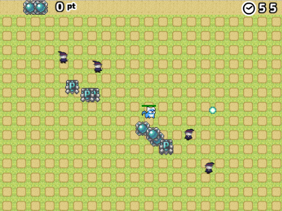

# 素材の差し替え
ここでは画像や音声の差し替えする際の手順について例を用いて説明していきたいと思います。

## 事前準備
Akashic ゲームの実行・開発には、Node.js のインストールなど事前準備が必要です。初めての方は [こちら](https://akashic-games.github.io/shin-ichiba/install.html) を参照してください。

### ゲームのビルド
このゲームはそのままでは実行することができないので、以下のようなコマンドをこのリポジトリで実行してビルドする必要があります。

```
npm install
npm run build
```

また、`npm start` を実行後、`http://localhost:3000` をブラウザで開くと改造前の状態のゲームを遊ぶことができます。

## 画像の差し替え手順
### アニメーションしない画像(アイテム画像)の場合
ここでは、武器のレベルを上げるアイテムをに差し替える手順を説明します。画像差し替え時は必ずしも差し替え後の画像のサイズを差し替え前のものに合わせる必要はありませんが、その場合ソースコードも修正する場合があるため今回はサイズを同じものにしています。

1. (`doc/image/a_01.png`)をimageディレクトリに置いて`shotup.png`にリネームする
2. `npm run update` を実行して差し替えを反映させる
3. `npm start` を実行してゲームを起動する

上記を実行することによってゲーム画面は以下のようになります。


### アニメーションする画像(キャラクター画像)の場合
ここではこのゲームのプレイヤーである犬の画像を以下の犬の画像に差し替える手順を説明します。  


アニメーションする画像についても、ソースコードの修正を割ける場合、各画像サイズと枚数とアニメーションの順番を元の画像に合わせる必要があります。

1. [`doc/image/character5.png`](image/character5.png)をimageディレクトリに置いて`character3.png`にリネームする
2. `npm run update` を実行して差し替えを反映させる
3. `npm start` を実行してゲームを起動する

上記を実行することによってゲーム画面は以下のようになります。



## 音声の差し替え手順
ここではアイテム取得時のSEを`doc/audio/se_item1`という別のSEに差し替える手順を説明します。

1. [`doc/audio/se_item1.aac`](audio/se_item1.aac)と[`doc/audio/se_item1.ogg`](audio/se_item1.ogg)をaudioディレクトリに置いてそれぞれ`se_item.aac`と`se_item.ogg`にリネームする
   * Akashic Engine では音声ファイルとしてaac形式とogg形式で同名のファイルがそれぞれ必要になります。
2. `npm run update` を実行して差し替えを反映させる
3. `npm start` を実行してゲームを起動する

上記を実行することによってアイテム取得時のSEが変わります。

## ゲームの公開方法
画像や音声を差し替えたものをニコ生ゲームとして公開することができます。公開方法については以下のURLを参照してください。
https://akashic-games.github.io/shin-ichiba/submit.html
